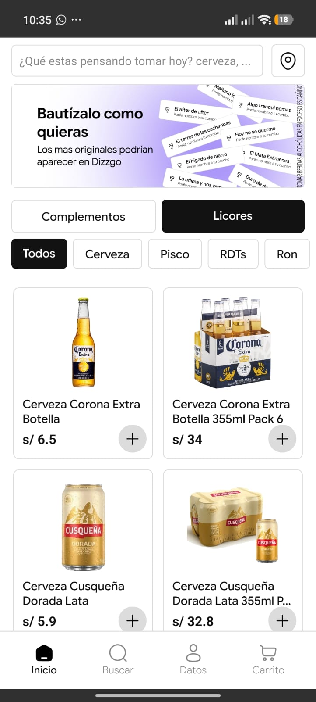
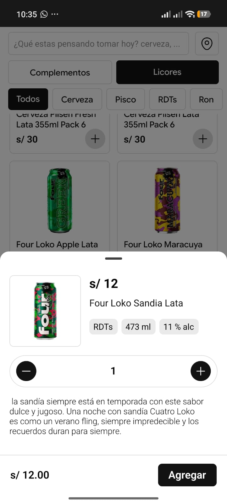
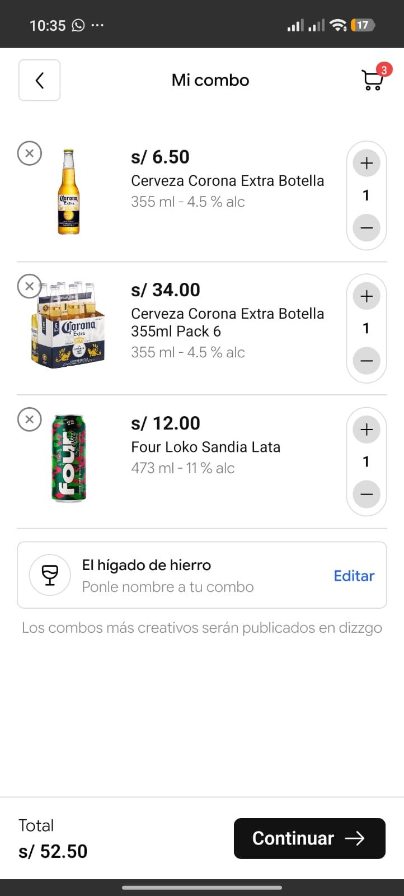
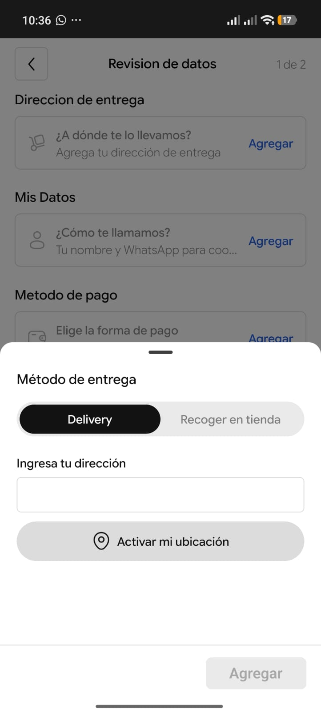

# Dizzgo: Tu app de licores

### Tu delivery de licores disponible en Abancay, armado a tu manera.

Arma tu combo, ponle nombre y recíbelo en tu puerta.

| Inicio | Detalle del producto | Mi combo | Método de entrega |
|:---:|:---:|:---:|:---:|
|  |  |  |  |

> 🔞 **Solo para mayores de 18 años.** Tomar bebidas alcohólicas en exceso es dañino para la salud.

---

## 📲 Descarga la app

Dizzgo se encuentra actualmente **en revisión en Google Play**. Mientras tanto, puedes instalarla directamente desde este repositorio:

1. Entra a la sección [**Releases**](https://github.com/TU_USUARIO/TU_REPO/releases/latest) de este repositorio.
2. Descarga el archivo `dizzgo.apk` de la última versión.
3. Ábrelo en tu celular Android. Si es necesario, activa **"Instalar apps de orígenes desconocidos"** cuando el sistema te lo pida.
4. Abre Dizzgo, agrega tus productos y haz tu pedido.

> Cuando la app sea aprobada en Google Play, este README se actualizará con el enlace oficial a la tienda.

---

## 🤔 ¿Qué es Dizzgo?

Dizzgo es un **marketplace de delivery de licores**. Elige tus bebidas favoritas, arma tu propio **combo**, ponle un nombre creativo y pídelo desde tu celular, sin complicaciones.

Todo el proceso toma pocos pasos: eliges, armas tu combo, indicas tu dirección y confirmas tu pedido.

---

## ✨ Características

- 🛒 **Catálogo por categorías:** cervezas, pisco, RTDs, ron y más, con filtros rápidos.
- 🧩 **Licores y complementos** en una misma app.
- 🔎 **Búsqueda rápida** para encontrar lo que se te antoja hoy.
- 🧾 **Detalle claro de cada producto:** precio, categoría, contenido (ml) y grado alcohólico.
- 🎉 **Combos con nombre propio:** bautiza tu combo como quieras. Los más originales podrían aparecer en Dizzgo.
- 🚚 **Delivery o recojo en tienda**, tú decides.
- 📍 **Ubicación:** ingresa tu dirección o usa tu ubicación actual.
- 💬 **Coordinación por WhatsApp** para el seguimiento de tu pedido.

---

## 🛍️ Cómo hacer tu pedido

| Paso | Qué haces |
|:---:|---|
| **1** | Explora el catálogo en **Inicio** y filtra por categoría (Cerveza, Pisco, RTDs, Ron…). |
| **2** | Toca un producto para ver su detalle y pulsa **Agregar**. |
| **3** | Ve a **Carrito → Mi combo**, ajusta cantidades y ponle un nombre creativo. |
| **4** | Pulsa **Continuar** y elige **Delivery** o **Recoger en tienda**. |
| **5** | Completa tus datos (nombre y WhatsApp) y tu método de pago. |
| **6** | Confirma tu pedido y listo. |

---

## 🧭 Navegación

La app cuenta con cuatro secciones principales en la barra inferior:

- **Inicio:** catálogo de productos.
- **Buscar:** encuentra productos por nombre o categoría.
- **Datos:** tu información de contacto y entrega.
- **Carrito:** tu combo actual.

---

## 🗺️ Estado del proyecto

- [x] Catálogo de licores y complementos
- [x] Combos personalizados con nombre
- [x] Flujo de pedido (delivery y recojo en tienda)
- [ ] Publicación en Google Play *(en revisión)*
- [ ] Más categorías y promociones

---

## 🐞 ¿Encontraste un problema o tienes una idea?

Abre un [**Issue**](https://github.com/TU_USUARIO/TU_REPO/issues) en este repositorio contándonos qué pasó o qué te gustaría ver en Dizzgo.

---

## ⚖️ Aviso legal

- La venta de bebidas alcohólicas está **prohibida a menores de 18 años**.
- **Tomar bebidas alcohólicas en exceso es dañino.** Disfruta con responsabilidad y no conduzcas si has bebido.

---

**Dizzgo** · Hecho en Abancay, Perú 🇵🇪
